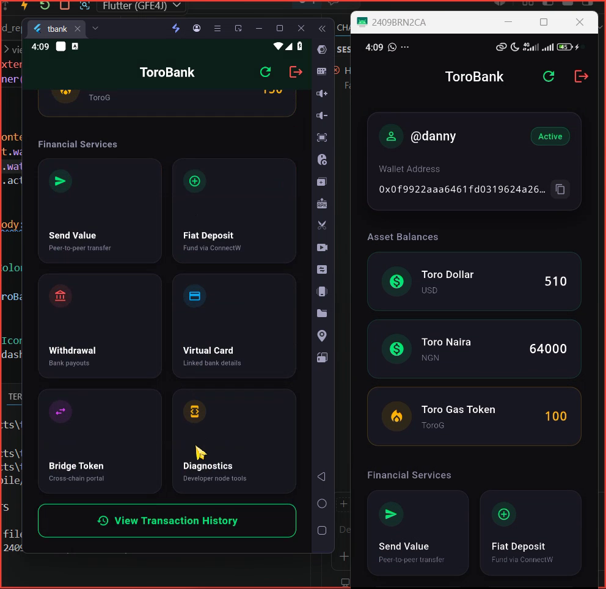
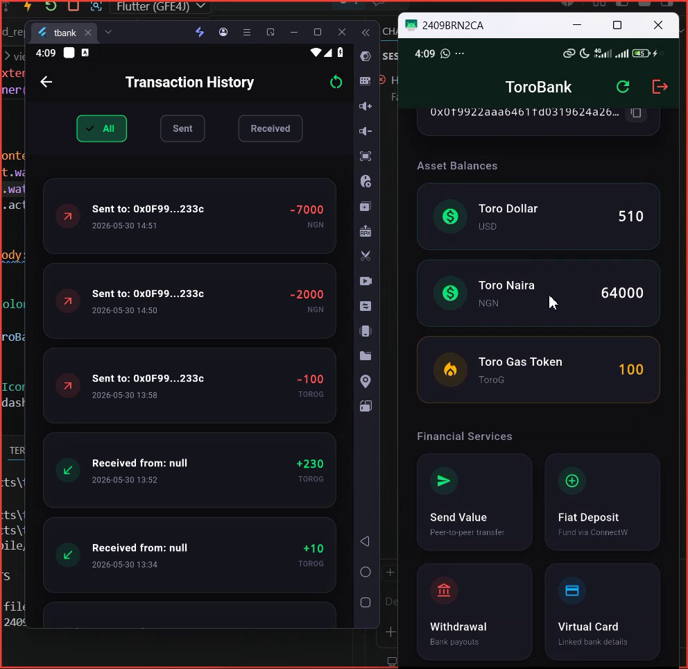
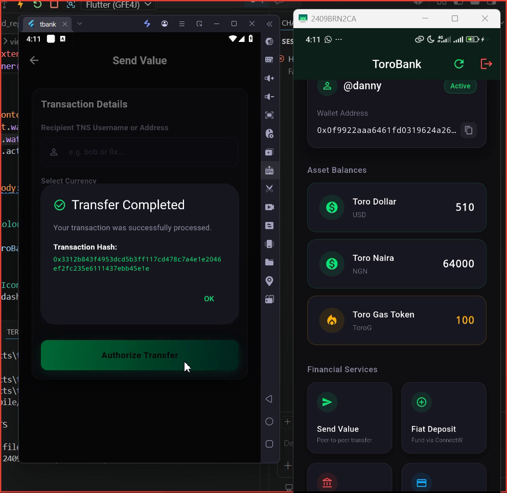
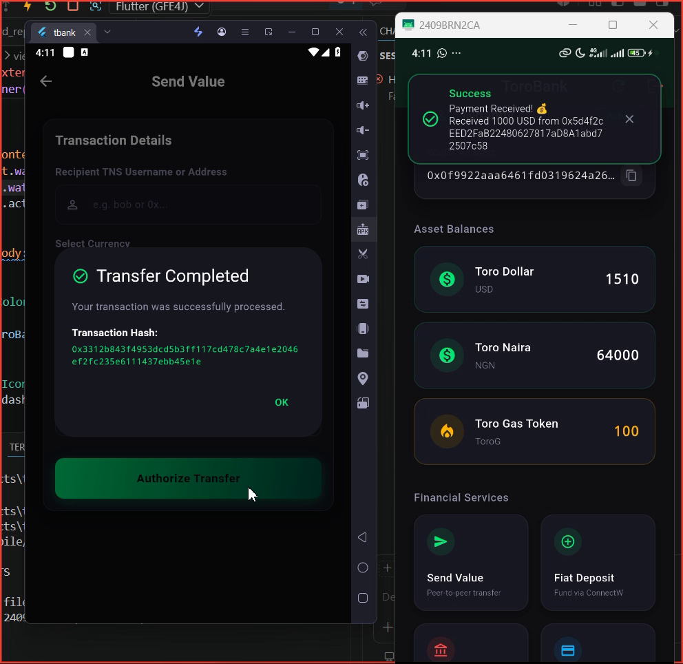

# 🟢 ToroBank — Toronet Flutter Starter Template

<p align="center">
  
</p>


ToroBank is a premium reference application built for Flutter developers to jumpstart their Web3 integration on the **Toronet Blockchain**. Leveraging a robust **Feature-First Clean Architecture**, state management via **Provider**, and a modern obsidian dark glassmorphism design themed with emerald gradients, this template serves as a production-grade template demonstrating real-world fintech patterns on Toronet.

---

## 📸 App Screenshots

<p align="center">
  
  
  
  
</p>

---

## 🎨 Design System & Aesthetics

ToroBank features a cohesive, premium UI designed to capture user engagement at first glance:
*   **Color Palette:** Obsidian Black (`#0F0F12`), Card Surface Dark (`#181820`), and Vivid Toro Emerald (`#00E676`) for primary interactions.
*   **Visual Assets:** Custom glassmorphism cards, linear gradients (`Color(0xFF00E676)` to `Color(0xFF004D40)`), and micro-interactions.
*   **Typography:** Modern sans-serif layouts with distinct weights prioritizing screen readability.

---

## 🚀 Quick File Navigation (Click to open in your IDE)
Use the links below to jump straight to the source code for key features:
*   [📱 Virtual Wallet Screen (`virtual_wallet_screen.dart`)](lib/src/features/virtual_wallet/presentation/views/virtual_wallet_screen.dart)
*   📊 Dashboard Controller (`dashboard_controller.dart`)
*   💸 Transfer Repository (`transfer_repository_impl.dart`)
*   🏦 Payment Repository (`payment_repository_impl.dart`)
*   🌉 Bridge Repository (`bridge_repository_impl.dart`)

---

## 🏗️ Architecture: Feature-First Clean Architecture

The project is structured around features, making the codebase highly modular, testable, and scale-friendly. Each feature is decoupled into three layers:

```text
lib/src/features/
├── onboarding/        # Key creation, importing, & TNS setup
├── dashboard/         # Multi-currency asset representation
├── transfer/          # Peer-to-peer token transfers (via address or TNS name)
├── payment/           # Bank deposits and withdrawal flows
├── bridge/            # Cross-chain bridging controls
├── history/           # Wallet transactions overview
└── developer/         # Node status, blocks, and revert reason explorer
```

### 📂 Feature Anatomy (Three-Layer Architecture)
Every feature directory contains:
1.  **Data Layer:** Contains repository implementations, local/remote data sources, and SDK integrations.
2.  **Domain Layer:** Declares entity models, use cases (business logic), and abstract repository interfaces.
3.  **Presentation Layer:** Houses controllers (Notifiers/State Managers) and UI views/widgets.

---

## 🔌 Core Toronet Integration Points

This template provides concrete, readable code showing how to bind Toronet features:

### 1. Initializing the Client
Defined globally inside the client wrapper (`toronet_client.dart`):
```dart
import 'package:toronet/toronet.dart';

class ToronetClient {
  late final ToronetSDK sdk;
  
  ToronetClient() {
    sdk = ToronetSDK(
      network: Env.network,
      options: SDKOptions(connectTimeout: const Duration(seconds: 15)),
    );
  }
  
  PaymentsService get payments => sdk.paymentsService;
  CurrencyService get currency => sdk.currencyService;
  TNSService get tns => sdk.tnsService;
}
```

### 2. Performing a P2P Token Transfer
Located in `TransferRepositoryImpl`:
```dart
final result = await _client.currency.transferCurrency(
  currency: currencyEnum,
  from: fromAddress,
  to: toAddress,
  amount: amount,
  fromPassword: password,
);
final txHash = result['result']?.toString() ?? result['txhash']?.toString() ?? '';
```

### 3. TNS (Toronet Name Service) Address Resolution
Located in `TransferRepositoryImpl`:
```dart
final response = await _client.tns.getAddress(name: cleanUsername);
final address = response['result']?.toString() ?? response['address']?.toString() ?? '';
```

### 4. Initiating and Polling Bank Deposits
Located in `PaymentRepositoryImpl`:
```dart
// Initiate
final depositResult = await _client.payments.depositFunds(
  userAddress: address,
  username: 'tbank_user',
  amount: amount,
  currency: pay.Currency.NGN, // or pay.Currency.USD
  admin: Env.adminAddress,
  adminpwd: Env.adminPassword,
);

// Confirm
final confirmResult = await _client.payments.confirmDeposit(
  currency: 'NGN',
  txid: paymentId,
  paymentType: 'bank',
  admin: Env.adminAddress,
  adminpwd: Env.adminPassword,
);
```

### 5. Executing Cross-Chain Bridging
Located in `BridgeRepositoryImpl`:
```dart
final response = await _client.bsc.bridgeToken(
  from: fromAddress,
  password: password,
  contractAddress: contractAddress,
  tokenName: tokenName,
  amount: amount,
  admin: Env.adminAddress,
  adminpwd: Env.adminPassword,
);
```

### 6. Wallet Provider Deep Link Integration
ToroBank acts as a unified wallet provider for the Toronet ecosystem, similar to MetaMask. Third-party dApps can trigger ToroBank to securely sign and broadcast transactions without managing private keys themselves.

**Deep Link Scheme:** `torobank://sign-tx`

**Parameters:**
- `amount`: Token amount to send
- `currency`: Token symbol (e.g. `ToroG`)
- `recipient`: Destination address
- `dappName`: Your dApp's name
- `callback`: URI to redirect back to (e.g. `myapp://tx-result`)

**Usage (Flutter Example):**
```dart
final uri = Uri.parse('torobank://sign-tx?amount=50&currency=ToroG&recipient=0xABC...&dappName=MyDapp&callback=mydapp://success');
if (await canLaunchUrl(uri)) {
  await launchUrl(uri, mode: LaunchMode.externalApplication);
}
```
Upon success, ToroBank redirects to: `mydapp://success?status=success&txHash=0x...`

---

## 🛠️ Configuration & Getting Started

### 📋 Prerequisites
- Flutter SDK `3.19.0` or higher
- Dart SDK `3.3.0` or higher

### ⚙️ Environment Configuration
Following secure development principles, sensitive node details are passed as compile-time variables:

1.  **Configure using file (Recommended for Local Dev):**
    Copy `config.json.example` to `config.json`:
    ```bash
    cp config.json.example config.json
    ```
    Populate the variables in `config.json`.
    
2.  **Run or Build with Configurations:**
    Pass the JSON configuration directly to compile:
    ```bash
    flutter run --dart-define-from-file=config.json
    ```
    Or passing parameters manually in CLI:
    ```bash
    flutter run --dart-define=TORONET_NETWORK=testnet --dart-define=TORONET_ADMIN_ADDRESS=0x...
    ```

---

## 🧪 Verification & Testing
To run tests and perform code quality assertions:
```bash
# Run unit & widget tests
flutter test

# Perform static analysis verification
flutter analyze
```

---

## 🤝 Community & Support
- **Toronet Docs:** [Toronet Developer Guide](https://toroforges-organization.gitbook.io/toroforge-collective/)
- **Discord Community:** Join the conversation on [Discord](https://discord.gg/45SMNdGx5d)